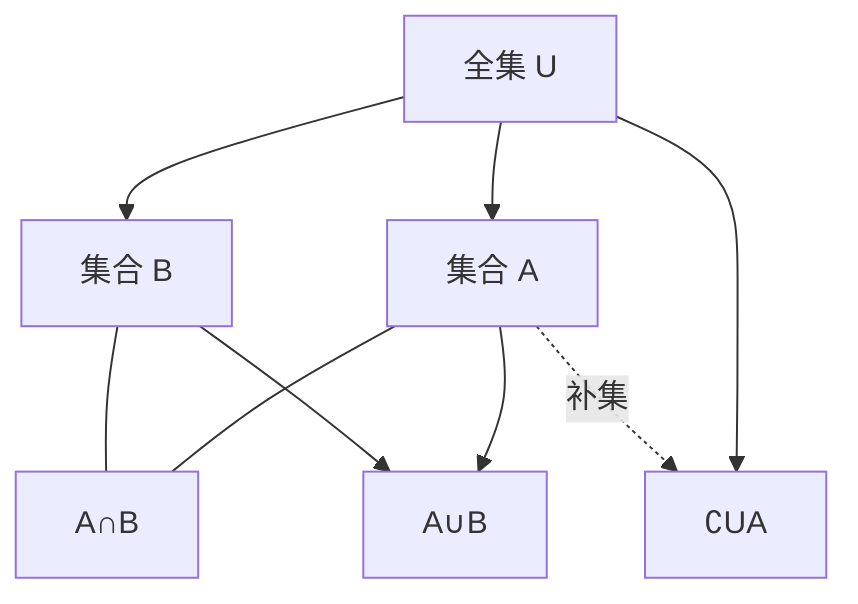
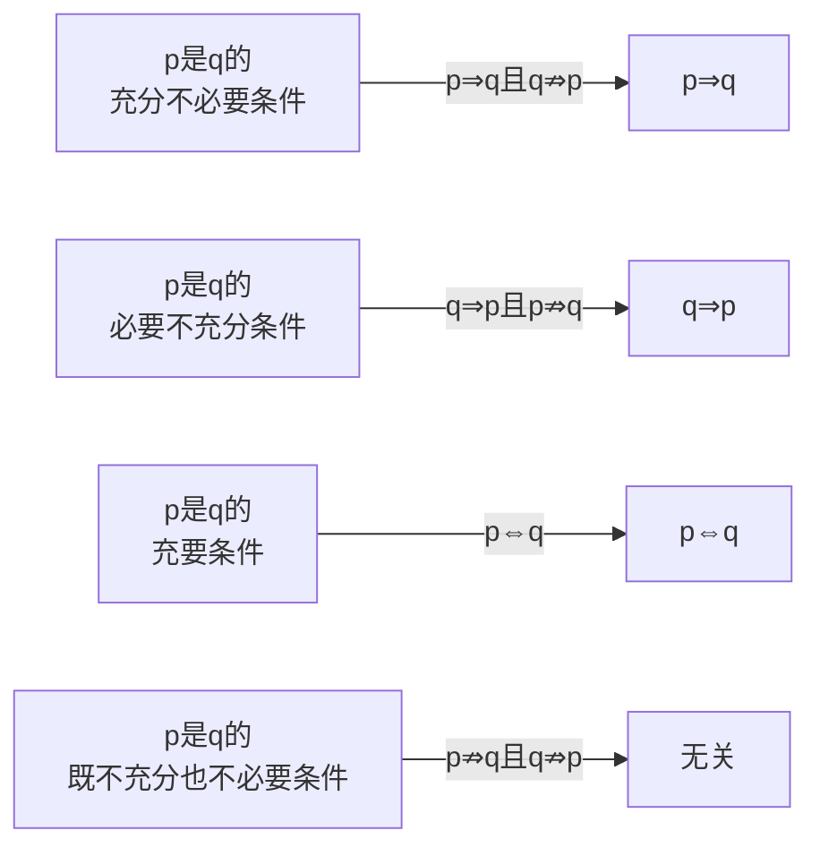
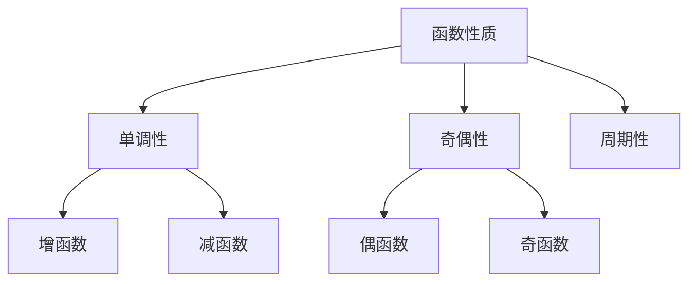
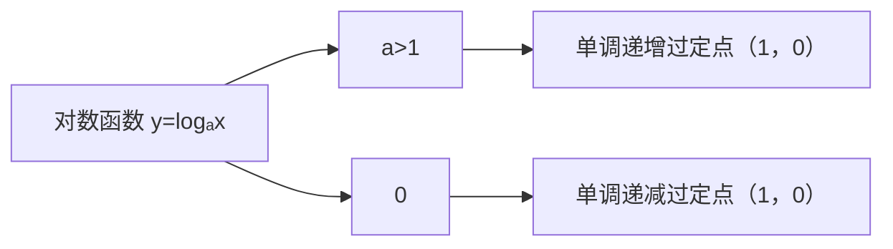
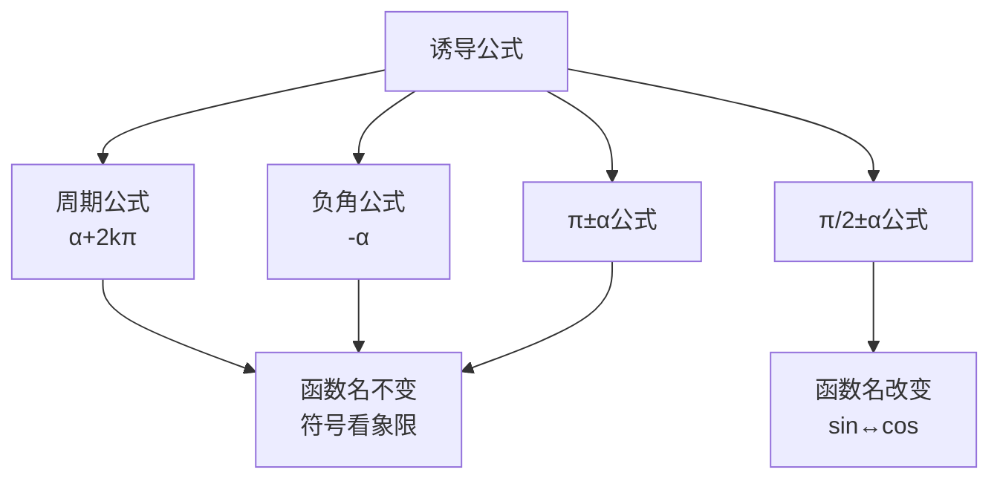
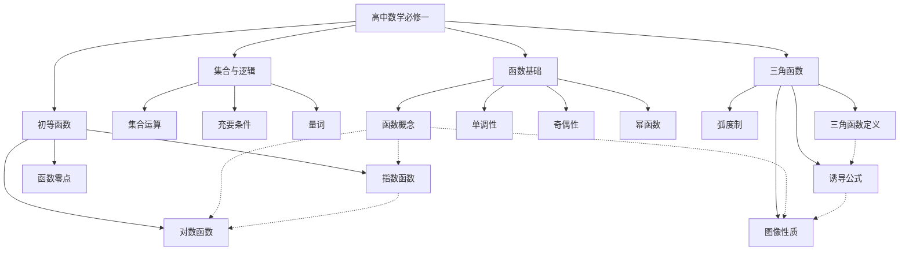

# 高中数学必修一 知识点详细内容

## 目录
1. [集合与常用逻辑用语](#一集合与常用逻辑用语)
2. [一元二次函数、方程和不等式](#二一元二次函数方程和不等式)
3. [函数的概念与性质](#三函数的概念与性质)
4. [指数函数与对数函数](#四指数函数与对数函数)
5. [三角函数](#五三角函数)

---

## 一、集合与常用逻辑用语

### 1.1 集合的概念

#### 1.1.1 集合的定义
**概念：** 集合是由确定的、互异的对象组成的整体，这些对象称为集合的元素。

**表示方法：**
- 列举法：$A = \{1, 2, 3, 4, 5\}$
- 描述法：$A = \{x \mid x \text{ 是小于6的正整数}\}$
- 图示法（韦恩图）

**元素与集合的关系：**
- 属于：$a \in A$（元素a属于集合A）
- 不属于：$a \notin A$（元素a不属于集合A）

#### 1.1.2 集合的特性
1. **确定性：** 任何一个对象都能明确判断是否属于某个集合
2. **互异性：** 集合中的元素互不相同，即 $a \in A, b \in A, a \neq b$
3. **无序性：** 集合中的元素没有顺序之分，$\{1, 2, 3\} = \{3, 2, 1\}$

#### 1.1.3 常用数集
| 数集 | 符号 | 含义 |
|------|------|------|
| 自然数集 | $\mathbb{N}$ | $\{0, 1, 2, 3, \cdots\}$ |
| 正整数集 | $\mathbb{N}^*$ 或 $\mathbb{N}_+$ | $\{1, 2, 3, \cdots\}$ |
| 整数集 | $\mathbb{Z}$ | $\{\cdots, -2, -1, 0, 1, 2, \cdots\}$ |
| 有理数集 | $\mathbb{Q}$ | 可以表示为两个整数之比的数 |
| 实数集 | $\mathbb{R}$ | 包括有理数和无理数 |

### 1.2 集合间的基本关系

#### 1.2.1 子集
**定义：** 如果集合A中的每一个元素都是集合B的元素，则称A是B的子集，记作 $A \subseteq B$。

**性质：**
- 自反性：$A \subseteq A$
- 传递性：若 $A \subseteq B$ 且 $B \subseteq C$，则 $A \subseteq C$
- 空集是任何集合的子集：$\emptyset \subseteq A$

#### 1.2.2 真子集
**定义：** 如果 $A \subseteq B$ 且 $A \neq B$，则称A是B的真子集，记作 $A \subsetneq B$。

**性质：** 空集是任何非空集合的真子集。

#### 1.2.3 集合相等
**定义：** 如果 $A \subseteq B$ 且 $B \subseteq A$，则 $A = B$。

#### 1.2.4 空集
**定义：** 不含任何元素的集合，记作 $\emptyset$ 或 $\{\}$。

**重要性质：** 空集是任何集合的子集，是任何非空集合的真子集。

```mermaid
graph TD
    A[集合关系] --> B[子集(dd) A⊆B]
    A --> C[真子集 A⊊B]
    A --> D[相等 A=B]
    B --> E[自反性]
    B --> F[传递性]
    C --> G[空集⊊A A≠∅]
```

### 1.3 集合的基本运算

#### 1.3.1 并集
**定义：** $A \cup B = \{x \mid x \in A \text{ 或 } x \in B\}$

**性质：**
- 交换律：$A \cup B = B \cup A$
- 结合律：$(A \cup B) \cup C = A \cup (B \cup C)$
- 幂等律：$A \cup A = A$
- 同一律：$A \cup \emptyset = A$

#### 1.3.2 交集
**定义：** $A \cap B = \{x \mid x \in A \text{ 且 } x \in B\}$

**性质：**
- 交换律：$A \cap B = B \cap A$
- 结合律：$(A \cap B) \cap C = A \cap (B \cap C)$
- 幂等律：$A \cap A = A$
- 零律：$A \cap \emptyset = \emptyset$

#### 1.3.3 补集
**定义：** 设U为全集，$A \subseteq U$，则A在U中的补集为：
$$\complement_U A = \{x \mid x \in U \text{ 且 } x \notin A\}$$

**性质（德摩根定律）：**
- $\complement_U(A \cup B) = \complement_U A \cap \complement_U B$
- $\complement_U(A \cap B) = \complement_U A \cup \complement_U B$

#### 1.3.4 运算关系图


### 1.4 充分条件与必要条件

#### 1.4.1 命题
**定义：** 能判断真假的陈述句称为命题。

#### 1.4.2 四种命题
原命题：若p，则q
- 逆命题：若q，则p
- 否命题：若$\neg p$，则$\neg q$
- 逆否命题：若$\neg q$，则$\neg p$

**重要结论：** 原命题与逆否命题等价；逆命题与否命题等价。

#### 1.4.3 充分条件、必要条件、充要条件
| 关系 | 定义 | 符号 |
|------|------|------|
| 充分条件 | $p \Rightarrow q$ | p是q的充分条件 |
| 必要条件 | $q \Rightarrow p$（即 $p \Leftarrow q$） | p是q的必要条件 |
| 充要条件 | $p \Leftrightarrow q$ | p是q的充要条件 |

**记忆口诀：** "小推大，小充分；大推小，小必要"

#### 1.4.4 条件关系图


### 1.5 全称量词与存在量词

#### 1.5.1 全称量词
**符号：** $\forall$（任意）

**命题形式：** $\forall x \in M, p(x)$

**否定：** $\exists x \in M, \neg p(x)$

#### 1.5.2 存在量词
**符号：** $\exists$（存在）

**命题形式：** $\exists x \in M, p(x)$

**否定：** $\forall x \in M, \neg p(x)$

---

## 二、一元二次函数、方程和不等式

### 2.1 等式性质与不等式性质

#### 2.1.1 等式的基本性质
1. 对称性：$a = b \Rightarrow b = a$
2. 传递性：$a = b, b = c \Rightarrow a = c$
3. 加减性质：$a = b \Rightarrow a \pm c = b \pm c$
4. 乘除性质：$a = b \Rightarrow ac = bc$；$a = b, c \neq 0 \Rightarrow \frac{a}{c} = \frac{b}{c}$

#### 2.1.2 不等式的基本性质
1. **对称性：** $a > b \Leftrightarrow b < a$
2. **传递性：** $a > b, b > c \Rightarrow a > c$
3. **可加性：** $a > b \Leftrightarrow a + c > b + c$
4. **可乘性：**
   - $a > b, c > 0 \Rightarrow ac > bc$
   - $a > b, c < 0 \Rightarrow ac < bc$（注意变号！）
5. **同向可加性：** $a > b, c > d \Rightarrow a + c > b + d$
6. **同向同正可乘性：** $a > b > 0, c > d > 0 \Rightarrow ac > bd$
7. **可乘方性：** $a > b > 0 \Rightarrow a^n > b^n$（$n \in \mathbb{N}, n \geq 2$）
8. **可开方性：** $a > b > 0 \Rightarrow \sqrt[n]{a} > \sqrt[n]{b}$（$n \in \mathbb{N}, n \geq 2$）

### 2.2 基本不等式

#### 2.2.1 基本不等式（均值不等式）
**定理：** 对于任意正实数 $a, b$：
$$\frac{a + b}{2} \geq \sqrt{ab}$$

当且仅当 $a = b$ 时，等号成立。

**使用条件（一正二定三相等）：**
1. **一正：** $a > 0, b > 0$
2. **二定：** $a + b$ 或 $ab$ 为定值
3. **三相等：** 等号能取到（即 $a = b$ 有解）

#### 2.2.2 常用变形
1. $a + b \geq 2\sqrt{ab}$
2. $ab \leq \left(\frac{a + b}{2}\right)^2$
3. 对于 $a, b, c > 0$：$\frac{a + b + c}{3} \geq \sqrt[3]{abc}$

#### 2.2.3 重要推论（二级结论）
1. 若 $x > 0$，则 $x + \frac{1}{x} \geq 2$（当 $x = 1$ 时取等）
2. 若 $x < 0$，则 $x + \frac{1}{x} \leq -2$（当 $x = -1$ 时取等）
3. 若 $a, b > 0$，则 $\frac{2}{\frac{1}{a} + \frac{1}{b}} \leq \sqrt{ab} \leq \frac{a + b}{2} \leq \sqrt{\frac{a^2 + b^2}{2}}$

### 2.3 一元二次函数

#### 2.3.1 定义
**定义：** 形如 $y = ax^2 + bx + c$（$a \neq 0$）的函数称为一元二次函数。

#### 2.3.2 三种表示形式
| 形式 | 表达式 | 适用场景 |
|------|--------|----------|
| 一般式 | $y = ax^2 + bx + c$ | 已知任意三点 |
| 顶点式 | $y = a(x - h)^2 + k$ | 已知顶点$(h, k)$ |
| 交点式 | $y = a(x - x_1)(x - x_2)$ | 已知与x轴交点 |

#### 2.3.3 图像与性质
**图像：** 抛物线

| 性质 | $a > 0$ | $a < 0$ |
|------|---------|---------|
| 开口方向 | 向上 | 向下 |
| 对称轴 | $x = -\frac{b}{2a}$ | $x = -\frac{b}{2a}$ |
| 顶点坐标 | $\left(-\frac{b}{2a}, \frac{4ac - b^2}{4a}\right)$ | $\left(-\frac{b}{2a}, \frac{4ac - b^2}{4a}\right)$ |
| 最值 | 最小值 $\frac{4ac - b^2}{4a}$ | 最大值 $\frac{4ac - b^2}{4a}$ |
| 单调性 | $(-\infty, -\frac{b}{2a})$递减，$(-\frac{b}{2a}, +\infty)$递增 | $(-\infty, -\frac{b}{2a})$递增，$(-\frac{b}{2a}, +\infty)$递减 |

#### 2.3.4 与坐标轴的交点
- **与y轴交点：** $(0, c)$
- **与x轴交点：** 令 $y = 0$，解 $ax^2 + bx + c = 0$

### 2.4 一元二次方程

#### 2.4.1 定义
**定义：** 形如 $ax^2 + bx + c = 0$（$a \neq 0$）的方程称为一元二次方程。

#### 2.4.2 求根公式
$$x = \frac{-b \pm \sqrt{b^2 - 4ac}}{2a}$$

#### 2.4.3 判别式
$$\Delta = b^2 - 4ac$$

| $\Delta$ 的值 | 根的情况 | 根的个数 |
|--------------|----------|----------|
| $\Delta > 0$ | 两个不相等的实数根 | 2个 |
| $\Delta = 0$ | 两个相等的实数根 | 1个（重根） |
| $\Delta < 0$ | 无实数根（有两个共轭复根） | 0个 |

#### 2.4.4 韦达定理（根与系数的关系）
若 $x_1, x_2$ 是方程 $ax^2 + bx + c = 0$ 的两根，则：
$$x_1 + x_2 = -\frac{b}{a}, \quad x_1 \cdot x_2 = \frac{c}{a}$$

**常用变形：**
1. $x_1^2 + x_2^2 = (x_1 + x_2)^2 - 2x_1x_2$
2. $\frac{1}{x_1} + \frac{1}{x_2} = \frac{x_1 + x_2}{x_1x_2}$
3. $|x_1 - x_2| = \frac{\sqrt{\Delta}}{|a|}$

### 2.5 一元二次不等式

#### 2.5.1 定义
**定义：** 形如 $ax^2 + bx + c > 0$（或 $< 0, \geq 0, \leq 0$）（$a \neq 0$）的不等式。

#### 2.5.2 解法（图像法）
设 $a > 0$，方程 $ax^2 + bx + c = 0$ 的两根为 $x_1 < x_2$：

| 不等式 | $\Delta > 0$ | $\Delta = 0$ | $\Delta < 0$ |
|--------|-------------|-------------|-------------|
| $ax^2 + bx + c > 0$ | $x < x_1$ 或 $x > x_2$ | $x \neq -\frac{b}{2a}$ | $\mathbb{R}$ |
| $ax^2 + bx + c \geq 0$ | $x \leq x_1$ 或 $x \geq x_2$ | $\mathbb{R}$ | $\mathbb{R}$ |
| $ax^2 + bx + c < 0$ | $x_1 < x < x_2$ | $\emptyset$ | $\emptyset$ |
| $ax^2 + bx + c \leq 0$ | $x_1 \leq x \leq x_2$ | $x = -\frac{b}{2a}$ | $\emptyset$ |

**口诀：** "大于取两边，小于取中间"（当 $a > 0$ 时）

#### 2.5.3 含参一元二次不等式
解题步骤：
1. 确定二次项系数是否为零
2. 确定判别式的符号
3. 比较两根大小
4. 写出解集

---

## 三、函数的概念与性质

### 3.1 函数的概念

#### 3.1.1 定义
**定义：** 设A、B是非空的数集，如果按照某种确定的对应关系f，使对于集合A中的任意一个数x，在集合B中都有唯一确定的数f(x)和它对应，那么就称f：A→B为从集合A到集合B的一个函数，记作：
$$y = f(x), \quad x \in A$$

**三要素：**
1. **定义域：** 自变量x的取值范围（集合A）
2. **值域：** 函数值y的集合 $\{f(x) \mid x \in A\}$
3. **对应关系：** 从x到y的对应法则f

**注意：** 定义域和对应关系确定，值域就确定。

#### 3.1.2 函数相等
两个函数相等当且仅当：
1. 定义域相同
2. 对应关系相同（即对定义域内每个x，f(x) = g(x)）

#### 3.1.3 区间的概念
| 区间 | 集合表示 | 含义 |
|------|----------|------|
| $[a, b]$ | $\{x \mid a \leq x \leq b\}$ | 闭区间 |
| $(a, b)$ | $\{x \mid a < x < b\}$ | 开区间 |
| $[a, b)$ | $\{x \mid a \leq x < b\}$ | 半开半闭区间 |
| $(a, b]$ | $\{x \mid a < x \leq b\}$ | 半开半闭区间 |
| $(-\infty, a]$ | $\{x \mid x \leq a\}$ | 无穷区间 |
| $(a, +\infty)$ | $\{x \mid x > a\}$ | 无穷区间 |

### 3.2 函数的表示法

#### 3.2.1 三种表示方法
1. **解析法：** 用数学表达式表示，如 $f(x) = x^2 + 2x + 1$
2. **列表法：** 用表格列出x与y的对应值
3. **图像法：** 用平面直角坐标系中的点集表示

#### 3.2.2 分段函数
**定义：** 在定义域的不同区间，有不同的对应关系的函数。

**示例：**
$$f(x) = \begin{cases} x + 1, & x \geq 0 \\ -x, & x < 0 \end{cases}$$

### 3.3 函数的基本性质

#### 3.3.1 单调性
**定义：**
- **增函数：** 对于定义域I内某个区间D上的任意两个自变量的值 $x_1, x_2$，当 $x_1 < x_2$ 时，都有 $f(x_1) < f(x_2)$，则称f(x)在区间D上是增函数。
- **减函数：** 对于定义域I内某个区间D上的任意两个自变量的值 $x_1, x_2$，当 $x_1 < x_2$ 时，都有 $f(x_1) > f(x_2)$，则称f(x)在区间D上是减函数。

**单调性判断方法：**
1. **定义法：** 作差 $f(x_1) - f(x_2)$，判断符号
2. **图像法：** 图像上升为增，下降为减
3. **导数法**（高二学习）：$f'(x) > 0$ 则增，$f'(x) < 0$ 则减

**单调区间：** 函数具有单调性的区间。

#### 3.3.2 最值
**最大值：** 设函数 $y = f(x)$ 的定义域为I，如果存在实数M满足：
1. 对于任意的 $x \in I$，都有 $f(x) \leq M$
2. 存在 $x_0 \in I$，使得 $f(x_0) = M$
则称M是函数 $y = f(x)$ 的最大值。

**最小值：** 类似定义，$f(x) \geq M$。

#### 3.3.3 奇偶性
**定义：**
- **偶函数：** 对于函数f(x)定义域内的任意x，都有 $f(-x) = f(x)$，则f(x)为偶函数。图像关于y轴对称。
- **奇函数：** 对于函数f(x)定义域内的任意x，都有 $f(-x) = -f(x)$，则f(x)为奇函数。图像关于原点对称。

**性质：**
1. 定义域关于原点对称是函数具有奇偶性的必要条件
2. 若奇函数在 $x = 0$ 处有定义，则 $f(0) = 0$
3. 偶函数 + 偶函数 = 偶函数
4. 奇函数 + 奇函数 = 奇函数
5. 偶函数 × 偶函数 = 偶函数
6. 奇函数 × 奇函数 = 偶函数
7. 奇函数 × 偶函数 = 奇函数



#### 3.3.4 重要推论（二级结论）
1. **单调性运算：**
   - 增 + 增 = 增
   - 减 + 减 = 减
   - 增 - 减 = 增
   - 减 - 增 = 减

2. **复合函数单调性（同增异减）：**
   - 内外函数单调性相同，则复合函数为增函数
   - 内外函数单调性相反，则复合函数为减函数

### 3.4 幂函数

#### 3.4.1 定义
**定义：** 形如 $y = x^\alpha$（$\alpha$ 为常数）的函数称为幂函数。

#### 3.4.2 常见幂函数性质
| 函数 | 定义域 | 值域 | 奇偶性 | 单调性 |
|------|--------|------|--------|--------|
| $y = x$ | $\mathbb{R}$ | $\mathbb{R}$ | 奇 | 增 |
| $y = x^2$ | $\mathbb{R}$ | $[0, +\infty)$ | 偶 | $(-\infty, 0)$减，$(0, +\infty)$增 |
| $y = x^3$ | $\mathbb{R}$ | $\mathbb{R}$ | 奇 | 增 |
| $y = x^{\frac{1}{2}} = \sqrt{x}$ | $[0, +\infty)$ | $[0, +\infty)$ | 非奇非偶 | 增 |
| $y = x^{-1} = \frac{1}{x}$ | $(-\infty, 0) \cup (0, +\infty)$ | $(-\infty, 0) \cup (0, +\infty)$ | 奇 | 在各区间内减 |

---

## 四、指数函数与对数函数

### 4.1 指数

#### 4.1.1 n次方根
**定义：** 如果 $x^n = a$，则x叫做a的n次方根。

**性质：**
- 当n为奇数时：$\sqrt[n]{a} = a^{\frac{1}{n}}$，对任意实数a有意义
- 当n为偶数时：$\sqrt[n]{a} = |a|^{\frac{1}{n}}$（$a \geq 0$）

#### 4.1.2 分数指数幂
$$a^{\frac{m}{n}} = \sqrt[n]{a^m} \quad (a > 0, m, n \in \mathbb{N}^*, n > 1)$$

$$a^{-\frac{m}{n}} = \frac{1}{a^{\frac{m}{n}}} = \frac{1}{\sqrt[n]{a^m}}$$

#### 4.1.3 指数幂的运算性质
1. $a^r \cdot a^s = a^{r+s}$（$a > 0, r, s \in \mathbb{Q}$）
2. $(a^r)^s = a^{rs}$（$a > 0, r, s \in \mathbb{Q}$）
3. $(ab)^r = a^r \cdot b^r$（$a > 0, b > 0, r \in \mathbb{Q}$）

### 4.2 指数函数

#### 4.2.1 定义
**定义：** 形如 $y = a^x$（$a > 0$ 且 $a \neq 1$）的函数称为指数函数。

#### 4.2.2 图像与性质
| 性质 | $a > 1$ | $0 < a < 1$ |
|------|---------|-------------|
| 图像 | 上升曲线 | 下降曲线 |
| 定义域 | $\mathbb{R}$ | $\mathbb{R}$ |
| 值域 | $(0, +\infty)$ | $(0, +\infty)$ |
| 过定点 | $(0, 1)$ | $(0, 1)$ |
| 单调性 | 增函数 | 减函数 |
| 函数值 | $x > 0$ 时 $y > 1$；$x < 0$ 时 $0 < y < 1$ | $x > 0$ 时 $0 < y < 1$；$x < 0$ 时 $y > 1$ |

```mermaid
graph LR
    A[指数函数 y=aˣ] --> B[a>1]
    A --> C[0<a<1]
    B --> D[单调递增<br/>过定点(0,1)]
    C --> E[单调递减<br/>过定点(0,1)]
```

#### 4.2.3 重要推论（二级结论）
1. 指数函数 $y = a^x$ 与 $y = (\frac{1}{a})^x$ 的图像关于y轴对称
2. 对于 $y = a^x$，底数越大，$x > 0$ 时图像上升越快
3. 比较大小：
   - 同底数：利用单调性
   - 同指数：利用幂函数性质
   - 不同底不同指数：找中间量（如0或1）

### 4.3 对数

#### 4.3.1 对数的定义
**定义：** 如果 $a^x = N$（$a > 0$ 且 $a \neq 1$），则数x叫做以a为底N的对数，记作：
$$x = \log_a N$$

其中a叫做**底数**，N叫做**真数**。

#### 4.3.2 常用对数与自然对数
| 类型 | 符号 | 定义 |
|------|------|------|
| 常用对数 | $\lg N$ | 以10为底，$\lg N = \log_{10} N$ |
| 自然对数 | $\ln N$ | 以e为底，$\ln N = \log_e N$（$e \approx 2.71828$） |

#### 4.3.3 对数的性质
1. $\log_a 1 = 0$（$a > 0, a \neq 1$）
2. $\log_a a = 1$（$a > 0, a \neq 1$）
3. 负数和零没有对数
4. $a^{\log_a N} = N$（$a > 0, a \neq 1, N > 0$）
5. $\log_a a^N = N$（$a > 0, a \neq 1$）

#### 4.3.4 对数的运算性质
1. $\log_a(M \cdot N) = \log_a M + \log_a N$（$M > 0, N > 0$）
2. $\log_a\frac{M}{N} = \log_a M - \log_a N$（$M > 0, N > 0$）
3. $\log_a M^n = n \log_a M$（$M > 0$）

#### 4.3.5 换底公式
$$\log_a b = \frac{\log_c b}{\log_c a} \quad (a > 0, a \neq 1; b > 0; c > 0, c \neq 1)$$

**推论：**
1. $\log_a b \cdot \log_b a = 1$
2. $\log_{a^n} b^m = \frac{m}{n} \log_a b$
3. $\log_a b = \frac{1}{\log_b a}$

### 4.4 对数函数

#### 4.4.1 定义
**定义：** 形如 $y = \log_a x$（$a > 0$ 且 $a \neq 1$）的函数称为对数函数。

#### 4.4.2 图像与性质
| 性质 | $a > 1$ | $0 < a < 1$ |
|------|---------|-------------|
| 图像 | 上升曲线 | 下降曲线 |
| 定义域 | $(0, +\infty)$ | $(0, +\infty)$ |
| 值域 | $\mathbb{R}$ | $\mathbb{R}$ |
| 过定点 | $(1, 0)$ | $(1, 0)$ |
| 单调性 | 增函数 | 减函数 |
| 函数值 | $x > 1$ 时 $y > 0$；$0 < x < 1$ 时 $y < 0$ | $x > 1$ 时 $y < 0$；$0 < x < 1$ 时 $y > 0$ |



#### 4.4.3 指数函数与对数函数的关系
**反函数关系：** 指数函数 $y = a^x$ 与对数函数 $y = \log_a x$ 互为反函数。

**性质：**
- 图像关于直线 $y = x$ 对称
- 定义域与值域互换

### 4.5 函数的零点与方程的解

#### 4.5.1 函数的零点
**定义：** 对于函数 $y = f(x)$，使 $f(x) = 0$ 的实数x叫做函数的零点。

**等价关系：**
方程 $f(x) = 0$ 有实数解 $\Leftrightarrow$ 函数 $y = f(x)$ 有零点 $\Leftrightarrow$ 函数图像与x轴有交点

#### 4.5.2 函数零点存在定理
**定理：** 如果函数 $y = f(x)$ 在区间 $[a, b]$ 上的图像是一条连续不断的曲线，并且有 $f(a) \cdot f(b) < 0$，那么函数 $y = f(x)$ 在区间 $(a, b)$ 内有零点，即存在 $c \in (a, b)$，使得 $f(c) = 0$。

**注意：**
1. 函数必须连续
2. $f(a) \cdot f(b) < 0$ 是充分不必要条件
3. 只能判断存在性，不能判断个数

#### 4.5.3 二分法
**适用条件：** 函数在区间 $[a, b]$ 上连续，且 $f(a) \cdot f(b) < 0$

**步骤：**
1. 取区间中点 $c = \frac{a + b}{2}$
2. 计算 $f(c)$
3. 若 $f(c) = 0$，则c就是零点
4. 若 $f(a) \cdot f(c) < 0$，则零点在 $(a, c)$ 内，令 $b = c$
5. 若 $f(c) \cdot f(b) < 0$，则零点在 $(c, b)$ 内，令 $a = c$
6. 重复直到达到精度要求

---

## 五、三角函数

### 5.1 任意角和弧度制

#### 5.1.1 角的概念的推广
**定义：** 角可以看作平面内一条射线绕着端点从一个位置旋转到另一个位置所形成的图形。

**分类：**
- 正角：按逆时针方向旋转形成的角
- 负角：按顺时针方向旋转形成的角
- 零角：没有旋转的角

#### 5.1.2 象限角
**定义：** 将角的顶点与原点重合，始边与x轴正半轴重合，终边落在第几象限，就称这个角为第几象限角。

| 象限 | 角的范围 |
|------|----------|
| 第一象限 | $\{\alpha \mid 2k\pi < \alpha < 2k\pi + \frac{\pi}{2}, k \in \mathbb{Z}\}$ |
| 第二象限 | $\{\alpha \mid 2k\pi + \frac{\pi}{2} < \alpha < 2k\pi + \pi, k \in \mathbb{Z}\}$ |
| 第三象限 | $\{\alpha \mid 2k\pi + \pi < \alpha < 2k\pi + \frac{3\pi}{2}, k \in \mathbb{Z}\}$ |
| 第四象限 | $\{\alpha \mid 2k\pi + \frac{3\pi}{2} < \alpha < 2k\pi + 2\pi, k \in \mathbb{Z}\}$ |

#### 5.1.3 终边相同的角
**定理：** 所有与角 $\alpha$ 终边相同的角，连同角 $\alpha$ 在内，构成的集合是：
$$S = \{\beta \mid \beta = \alpha + 2k\pi, k \in \mathbb{Z}\}$$

#### 5.1.4 弧度制
**定义：** 长度等于半径的弧所对的圆心角叫做1弧度的角，记作1 rad。

**角度与弧度的换算：**
$$1° = \frac{\pi}{180} \text{ rad} \approx 0.01745 \text{ rad}$$
$$1 \text{ rad} = \frac{180°}{\pi} \approx 57.30° = 57°18'$$

**常用特殊角换算：**
| 角度 | 0° | 30° | 45° | 60° | 90° | 180° | 270° | 360° |
|------|----|-----|-----|-----|-----|------|------|------|
| 弧度 | 0 | $\frac{\pi}{6}$ | $\frac{\pi}{4}$ | $\frac{\pi}{3}$ | $\frac{\pi}{2}$ | $\pi$ | $\frac{3\pi}{2}$ | $2\pi$ |

**弧长与扇形面积公式：**
- 弧长公式：$l = |\alpha| \cdot r$（$\alpha$ 为弧度制圆心角）
- 扇形面积：$S = \frac{1}{2}lr = \frac{1}{2}|\alpha|r^2$

### 5.2 三角函数的概念

#### 5.2.1 单位圆定义
设角 $\alpha$ 的终边与单位圆交于点 $P(x, y)$，则：
$$\sin \alpha = y, \quad \cos \alpha = x, \quad \tan \alpha = \frac{y}{x} (x \neq 0)$$

#### 5.2.2 一般定义
设角 $\alpha$ 终边上任意一点 $P(x, y)$，$r = \sqrt{x^2 + y^2} > 0$，则：
$$\sin \alpha = \frac{y}{r}, \quad \cos \alpha = \frac{x}{r}, \quad \tan \alpha = \frac{y}{x} (x \neq 0)$$

#### 5.2.3 三角函数在各象限的符号
```
        y
        |
   II   |   I
   S+   |   A+
   C-   |   T+
        |
--------+-------- x
        |
   III  |   IV
   S-   |   S-
   C-   |   C+
   T+   |   T-
        |
```

**记忆口诀：** "一全正，二正弦，三正切，四余弦"

#### 5.2.4 特殊角的三角函数值
| 角 | 0 | $\frac{\pi}{6}$ | $\frac{\pi}{4}$ | $\frac{\pi}{3}$ | $\frac{\pi}{2}$ | $\pi$ | $\frac{3\pi}{2}$ |
|----|---|----------------|----------------|----------------|----------------|-------|------------------|
| sin | 0 | $\frac{1}{2}$ | $\frac{\sqrt{2}}{2}$ | $\frac{\sqrt{3}}{2}$ | 1 | 0 | -1 |
| cos | 1 | $\frac{\sqrt{3}}{2}$ | $\frac{\sqrt{2}}{2}$ | $\frac{1}{2}$ | 0 | -1 | 0 |
| tan | 0 | $\frac{\sqrt{3}}{3}$ | 1 | $\sqrt{3}$ | 不存在 | 0 | 不存在 |

**记忆口诀：** "一二三，三二一，三九二十七"

### 5.3 同角三角函数的基本关系

#### 5.3.1 平方关系
$$\sin^2 \alpha + \cos^2 \alpha = 1$$

**变形：**
- $\sin^2 \alpha = 1 - \cos^2 \alpha$
- $\cos^2 \alpha = 1 - \sin^2 \alpha$
- $\sin \alpha = \pm\sqrt{1 - \cos^2 \alpha}$（符号由象限确定）

#### 5.3.2 商数关系
$$\tan \alpha = \frac{\sin \alpha}{\cos \alpha} \quad (\cos \alpha \neq 0)$$

#### 5.3.3 重要推论（二级结论）
1. $(\sin \alpha + \cos \alpha)^2 = 1 + 2\sin \alpha \cos \alpha$
2. $(\sin \alpha - \cos \alpha)^2 = 1 - 2\sin \alpha \cos \alpha$
3. 已知 $\tan \alpha = t$，则：
   - $\sin \alpha = \frac{t}{\sqrt{1 + t^2}}$（符号由象限确定）
   - $\cos \alpha = \frac{1}{\sqrt{1 + t^2}}$（符号由象限确定）
4. 齐次式处理：对于关于 $\sin \alpha, \cos \alpha$ 的齐次式，可除以 $\cos^n \alpha$ 化为关于 $\tan \alpha$ 的式子

### 5.4 诱导公式

#### 5.4.1 公式概述
**口诀：** "奇变偶不变，符号看象限"

**解释：**
- "奇偶"：指 $\frac{\pi}{2}$ 的倍数是奇数还是偶数
- "变"：函数名改变（sin↔cos, tan↔cot）
- "符号"：把 $\alpha$ 看作锐角时，原函数在相应象限的符号

#### 5.4.2 公式分类

**公式一（周期公式）：**
$$\sin(\alpha + 2k\pi) = \sin \alpha, \quad \cos(\alpha + 2k\pi) = \cos \alpha, \quad \tan(\alpha + 2k\pi) = \tan \alpha$$

**公式二（$\pi + \alpha$）：**
$$\sin(\pi + \alpha) = -\sin \alpha, \quad \cos(\pi + \alpha) = -\cos \alpha, \quad \tan(\pi + \alpha) = \tan \alpha$$

**公式三（$-\alpha$）：**
$$\sin(-\alpha) = -\sin \alpha, \quad \cos(-\alpha) = \cos \alpha, \quad \tan(-\alpha) = -\tan \alpha$$

**公式四（$\pi - \alpha$）：**
$$\sin(\pi - \alpha) = \sin \alpha, \quad \cos(\pi - \alpha) = -\cos \alpha, \quad \tan(\pi - \alpha) = -\tan \alpha$$

**公式五（$\frac{\pi}{2} - \alpha$）：**
$$\sin\left(\frac{\pi}{2} - \alpha\right) = \cos \alpha, \quad \cos\left(\frac{\pi}{2} - \alpha\right) = \sin \alpha$$

**公式六（$\frac{\pi}{2} + \alpha$）：**
$$\sin\left(\frac{\pi}{2} + \alpha\right) = \cos \alpha, \quad \cos\left(\frac{\pi}{2} + \alpha\right) = -\sin \alpha$$



### 5.5 三角函数的图像与性质

#### 5.5.1 正弦函数 $y = \sin x$

| 性质 | 内容 |
|------|------|
| 定义域 | $\mathbb{R}$ |
| 值域 | $[-1, 1]$ |
| 周期 | $2\pi$ |
| 奇偶性 | 奇函数 |
| 单调增区间 | $[2k\pi - \frac{\pi}{2}, 2k\pi + \frac{\pi}{2}]$（$k \in \mathbb{Z}$） |
| 单调减区间 | $[2k\pi + \frac{\pi}{2}, 2k\pi + \frac{3\pi}{2}]$（$k \in \mathbb{Z}$） |
| 最大值 | 1（当 $x = 2k\pi + \frac{\pi}{2}$ 时） |
| 最小值 | -1（当 $x = 2k\pi - \frac{\pi}{2}$ 时） |
| 对称轴 | $x = k\pi + \frac{\pi}{2}$（$k \in \mathbb{Z}$） |
| 对称中心 | $(k\pi, 0)$（$k \in \mathbb{Z}$） |

#### 5.5.2 余弦函数 $y = \cos x$

| 性质 | 内容 |
|------|------|
| 定义域 | $\mathbb{R}$ |
| 值域 | $[-1, 1]$ |
| 周期 | $2\pi$ |
| 奇偶性 | 偶函数 |
| 单调增区间 | $[2k\pi - \pi, 2k\pi]$（$k \in \mathbb{Z}$） |
| 单调减区间 | $[2k\pi, 2k\pi + \pi]$（$k \in \mathbb{Z}$） |
| 最大值 | 1（当 $x = 2k\pi$ 时） |
| 最小值 | -1（当 $x = 2k\pi + \pi$ 时） |
| 对称轴 | $x = k\pi$（$k \in \mathbb{Z}$） |
| 对称中心 | $(k\pi + \frac{\pi}{2}, 0)$（$k \in \mathbb{Z}$） |

#### 5.5.3 正切函数 $y = \tan x$

| 性质 | 内容 |
|------|------|
| 定义域 | $\{x \mid x \neq k\pi + \frac{\pi}{2}, k \in \mathbb{Z}\}$ |
| 值域 | $\mathbb{R}$ |
| 周期 | $\pi$ |
| 奇偶性 | 奇函数 |
| 单调增区间 | $(k\pi - \frac{\pi}{2}, k\pi + \frac{\pi}{2})$（$k \in \mathbb{Z}$） |
| 对称中心 | $(\frac{k\pi}{2}, 0)$（$k \in \mathbb{Z}$） |

**注意：** 正切函数在每个周期内单调递增，但在整个定义域上不是单调函数。

#### 5.5.4 函数 $y = A\sin(\omega x + \varphi)$ 的图像

**参数意义：**
| 参数 | 意义 | 影响 |
|------|------|------|
| $A$ | 振幅 | 最大值 $|A|$，最小值 $-|A|$ |
| $\omega$ | 角频率 | 周期 $T = \frac{2\pi}{|\omega|}$ |
| $\varphi$ | 初相 | 左右平移，平移量 $\frac{|\varphi|}{\omega}$ |

**图像变换（从 $y = \sin x$ 到 $y = A\sin(\omega x + \varphi)$）：**
1. **相位变换：** $y = \sin x \to y = \sin(x + \varphi)$（左加右减）
2. **周期变换：** $y = \sin(x + \varphi) \to y = \sin(\omega x + \varphi)$（横坐标变为原来的 $\frac{1}{\omega}$）
3. **振幅变换：** $y = \sin(\omega x + \varphi) \to y = A\sin(\omega x + \varphi)$（纵坐标变为原来的 $A$ 倍）

graph LR
    A[y=sinx] -->|左移φ| B[y=sin(x+φ)]
    B -->|横坐标缩为1/ω| C[y=sin(ωx+φ)]
    C -->|纵坐标伸为A倍| D[y=Asin(ωx+φ)]

#### 5.5.5 重要推论（二级结论）
1. **五点作图法：** 对于 $y = A\sin(\omega x + \varphi)$，令 $\omega x + \varphi = 0, \frac{\pi}{2}, \pi, \frac{3\pi}{2}, 2\pi$，求出对应的x和y值

2. **对称性：**
   - 正弦曲线对称轴：过最值点且垂直于x轴的直线
   - 正弦曲线对称中心：图像与平衡位置的交点

3. **最值问题：** 对于 $y = A\sin(\omega x + \varphi) + B$，最大值为 $|A| + B$，最小值为 $-|A| + B$

---

## 附录：知识点关联图



---

*本文档涵盖了高中数学必修一的全部核心知识点，建议结合课本和习题进行深入学习。*
