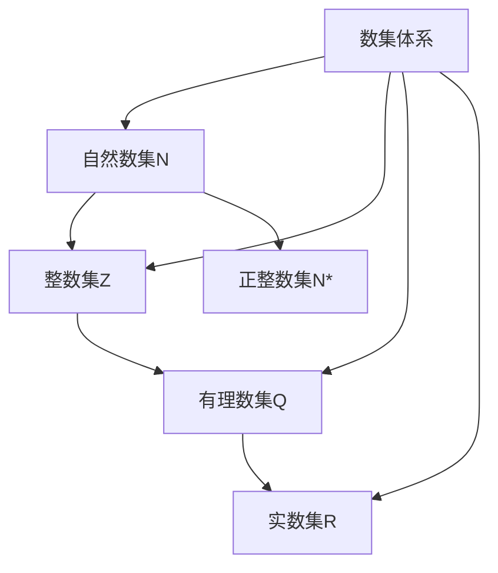

# 高中数学必修一 知识点详解

> **说明**：本文档按照人教版高中数学必修一教材顺序编排，包含集合与常用逻辑用语、一元二次函数方程和不等式、函数的概念与性质、指数函数与对数函数、三角函数五大章节。
> 
> **重要性级别说明**：A类为必须掌握的核心知识点，B类为重要拓展知识点，C类为补充了解知识点。

---

## 第一章 集合与常用逻辑用语

### 1.1 集合的概念

#### 1.1.1 集合的含义

**定义**：把一些确定的、不同的对象看成一个整体，这个整体就是由这些对象的全体组成的集合（简称集）。组成集合的每个对象叫做这个集合的元素。

**通俗理解**：集合就像是一个"袋子"，可以把具有某种共同特征的东西装进去。比如"班上的所有男生"、"小于10的正整数"等都可以构成集合。

**重要性级别**：A

**特性**：
- **确定性**：任何一个对象要么属于这个集合，要么不属于，界限明确
- **互异性**：集合中的元素互不相同，不能重复
- **无序性**：集合中的元素没有顺序之分，{1,2,3}与{3,2,1}是同一集合

**表示方法**：
- 集合通常用大写字母A、B、C等表示
- 元素通常用小写字母a、b、c等表示
- 常用数集：自然数集$\mathbb{N}$、整数集$\mathbb{Z}$、有理数集$\mathbb{Q}$、实数集$\mathbb{R}$、正整数集$\mathbb{N}^*$或$\mathbb{N}_+$

**关系图**：

---

#### 1.1.2 元素与集合的关系

**定义**：如果a是集合A的元素，就说a属于集合A，记作$ a \in A $；如果a不是集合A的元素，就说a不属于集合A，记作$ a \notin A $。

**重要性级别**：A

**特性**：
- 元素与集合的关系只有两种：属于或不属于
- 符号$ \in $和$ \notin $具有方向性，左边是元素，右边是集合

**二级结论**：
- 对于元素a和集合A，$ a \in A $与$ a \notin A $有且仅有一个成立（排中律）

---

### 1.2 集合的基本关系

#### 1.2.1 子集

**定义**：对于两个集合A和B，如果集合A中任意一个元素都是集合B中的元素，就称集合A为集合B的子集，记作$ A \subseteq B $（或$ B \supseteq A $），读作"A包含于B"（或"B包含A"）。

**数学表达**：$ A \subseteq B \Leftrightarrow \forall x \in A, x \in B $

**重要性级别**：A

**特性**：
- **自反性**：任何集合都是它本身的子集，即$ A \subseteq A $
- **传递性**：若$ A \subseteq B $且$ B \subseteq C $，则$ A \subseteq C $

---

#### 1.2.2 真子集

**定义**：如果集合$ A \subseteq B $，但存在元素$ x \in B $且$ x \notin A $，就称集合A是集合B的真子集，记作$ A \subsetneq B $（或$ B \supsetneq A $）。

**通俗理解**：A是B的子集，且A不等于B，即B中至少有一个元素不在A中。

**重要性级别**：A

**特性**：
- **传递性**：若$ A \subsetneq B $且$ B \subsetneq C $，则$ A \subsetneq C $
- **非自反性**：$ A \not\subsetneq A $

---

#### 1.2.3 集合相等

**定义**：如果集合A的任何一个元素都是集合B的元素，同时集合B的任何一个元素都是集合A的元素，那么集合A与集合B相等，记作$ A = B $。

**数学表达**：$ A = B \Leftrightarrow A \subseteq B \text{且} B \subseteq A $

**重要性级别**：A

---

#### 1.2.4 空集

**定义**：不含任何元素的集合叫做空集，记作$ \varnothing $。

**重要性级别**：A

**特性**：
- 空集是任何集合的子集：$ \varnothing \subseteq A $
- 空集是任何非空集合的真子集：若$ A \neq \varnothing $，则$ \varnothing \subsetneq A $
- 空集只有一个，即空集是唯一的

**易错提醒**：0、{0}、$ \varnothing $、{$ \varnothing $}是四个不同的概念！

---

### 1.3 集合的基本运算

#### 1.3.1 并集

**定义**：由所有属于集合A或属于集合B的元素组成的集合，称为集合A与B的并集，记作$ A \cup B $。

**数学表达**：$ A \cup B = \{x | x \in A \text{或} x \in B\} $

**重要性级别**：A

**运算性质**：
- **交换律**：$ A \cup B = B \cup A $
- **结合律**：$ (A \cup B) \cup C = A \cup (B \cup C) $
- **幂等律**：$ A \cup A = A $
- **同一律**：$ A \cup \varnothing = A $

---

#### 1.3.2 交集

**定义**：由所有既属于集合A又属于集合B的元素组成的集合，称为集合A与B的交集，记作$ A \cap B $。

**数学表达**：$ A \cap B = \{x | x \in A \text{且} x \in B\} $

**重要性级别**：A

**运算性质**：
- **交换律**：$ A \cap B = B \cap A $
- **结合律**：$ (A \cap B) \cap C = A \cap (B \cap C) $
- **幂等律**：$ A \cap A = A $
- **零律**：$ A \cap \varnothing = \varnothing $

**二级结论**：$ A \subseteq B \Leftrightarrow A \cap B = A \Leftrightarrow A \cup B = B $

---

#### 1.3.3 补集

**定义**：设U是一个全集，由U中不属于A的所有元素组成的集合，称为集合A相对于全集U的补集，记作$ \complement_U A $。

**重要性级别**：A

**运算性质（德摩根定律）**：
- $ \complement_U (A \cup B) = \complement_U A \cap \complement_U B $
- $ \complement_U (A \cap B) = \complement_U A \cup \complement_U B $
- $ \complement_U (\complement_U A) = A $

**德摩根定律记忆口诀**：并的补等于补的交，交的补等于补的并。

---

### 1.4 常用逻辑用语

#### 1.4.1 命题

**定义**：用语言、符号或式子表达的，可以判断真假的陈述句叫做命题。判断为真的语句是真命题，判断为假的语句是假命题。

**重要性级别**：A

**特性**：
- 命题必须是陈述句，疑问句、祈使句、感叹句都不是命题
- 命题必须能判断真假，且真假必居其一

---

#### 1.4.2 充分条件与必要条件

**定义**：
- 若$ p \Rightarrow q $，则p是q的**充分条件**，q是p的**必要条件**
- 若$ p \Rightarrow q $且$ q \nRightarrow p $，则p是q的**充分不必要条件**
- 若$ q \Rightarrow p $且$ p \nRightarrow q $，则p是q的**必要不充分条件**
- 若$ p \Leftrightarrow q $，则p是q的**充要条件**
- 若$ p \nRightarrow q $且$ q \nRightarrow p $，则p是q的**既不充分也不必要条件**

**重要性级别**：A

**集合观点理解**：
- 设$ A = \{x | p(x)\} $，$ B = \{x | q(x)\} $
- $ A \subseteq B \Leftrightarrow p$是q的充分条件
- $ B \subseteq A \Leftrightarrow p$是q的必要条件
- $ A = B \Leftrightarrow p$是q的充要条件

**二级结论**：原命题与其逆否命题同真同假

---

#### 1.4.3 全称量词与存在量词

**定义**：
- **全称量词**：用符号"$ \forall $"表示，读作"对所有的"、"对任意一个"
- **存在量词**：用符号"$ \exists $"表示，读作"存在一个"、"至少有一个"

**命题形式**：
- 全称命题：$ \forall x \in M, p(x) $
- 特称命题：$ \exists x \in M, p(x) $

**重要性级别**：A

**命题的否定**：
- 全称命题的否定是特称命题：$ \neg(\forall x \in M, p(x)) \Leftrightarrow \exists x \in M, \neg p(x) $
- 特称命题的否定是全称命题：$ \neg(\exists x \in M, p(x)) \Leftrightarrow \forall x \in M, \neg p(x) $

**记忆口诀**：全称变存在，存在变全称，结论变否定

---

## 第二章 一元二次函数、方程和不等式

### 2.1 等式性质与不等式性质

#### 2.1.1 不等式的概念

**定义**：用不等号（<、>、≤、≥、≠）连接两个代数式所成的式子叫做不等式。

**重要性级别**：A

---

#### 2.1.2 实数大小比较

**定义**：$ a - b > 0 \Leftrightarrow a > b $；$ a - b = 0 \Leftrightarrow a = b $；$ a - b < 0 \Leftrightarrow a < b $

**重要性级别**：A

**比较方法**：作差法、作商法、中间量法

---

#### 2.1.3 不等式的性质

**基本性质**：
- **对称性**：$ a > b \Leftrightarrow b < a $
- **传递性**：$ a > b, b > c \Rightarrow a > c $
- **可加性**：$ a > b \Leftrightarrow a + c > b + c $
- **可乘性**：$ a > b, c > 0 \Rightarrow ac > bc $；$ a > b, c < 0 \Rightarrow ac < bc $（**乘负数要变号**）

**重要性级别**：A

**易错提醒**：不等式两边同乘（除）以一个负数时，不等号方向必须改变

---

### 2.2 基本不等式

#### 2.2.1 基本不等式

**定理**：如果$ a > 0, b > 0 $，那么$ \frac{a+b}{2} \geq \sqrt{ab} $，当且仅当$ a = b $时，等号成立。

**文字表述**：两个正数的算术平均数不小于它们的几何平均数。

**重要性级别**：A

**使用条件（一正二定三相等）**：
1. **一正**：$ a > 0, b > 0 $（两数必须为正）
2. **二定**：和或积为定值
3. **三相等**：等号能取到

**变形公式**：
- $ a + b \geq 2\sqrt{ab} $（积定和最小）
- $ ab \leq (\frac{a+b}{2})^2 $（和定积最大）

---

#### 2.2.2 基本不等式的应用

**重要性级别**：A

**常见题型**：求最值、证明不等式

**凑配技巧**：凑系数、凑项

**二级结论**：若$ a, b \in \mathbb{R} $，则$ a^2 + b^2 \geq 2ab $（无条件限制）

---

### 2.3 二次函数与一元二次方程、不等式

#### 2.3.1 一元二次不等式

**定义**：只含有一个未知数，并且未知数的最高次数是2的不等式，称为一元二次不等式。

**标准形式**：$ ax^2 + bx + c > 0 $或$ ax^2 + bx + c < 0 $（$ a \neq 0 $）

**重要性级别**：A

---

#### 2.3.2 二次函数与一元二次方程的关系

**定义**：二次函数$ y = ax^2 + bx + c $（$ a \neq 0 $）的图象与x轴交点的横坐标，就是一元二次方程$ ax^2 + bx + c = 0 $的实数根。

**判别式**$ \Delta = b^2 - 4ac $：
- $ \Delta > 0 $：两个不相等的实数根
- $ \Delta = 0 $：两个相等的实数根
- $ \Delta < 0 $：没有实数根

**重要性级别**：A

---

#### 2.3.3 一元二次不等式的解法

**解法步骤**：
1. 将不等式化为标准形式（右边为0，二次项系数为正）
2. 计算判别式$ \Delta = b^2 - 4ac $，求出对应方程的根
3. 根据二次函数图象开口方向和根的情况，确定不等式的解集

**解集规律**（设$ x_1 < x_2 $）：
- $ ax^2 + bx + c > 0 $（$ a > 0 $）：$ \{x | x < x_1 \text{或} x > x_2\} $（大于取两边）
- $ ax^2 + bx + c < 0 $（$ a > 0 $）：$ \{x | x_1 < x < x_2\} $（小于取中间）

**重要性级别**：A

---

#### 2.3.4 含参数的一元二次不等式

**重要性级别**：B

**分类讨论要点**：
1. 二次项系数：讨论$ a > 0 $、$ a = 0 $、$ a < 0 $
2. 判别式：讨论$ \Delta > 0 $、$ \Delta = 0 $、$ \Delta < 0 $
3. 根的大小：讨论$ x_1 > x_2 $、$ x_1 = x_2 $、$ x_1 < x_2 $

---

## 第三章 函数的概念与性质

### 3.1 函数的概念及其表示

#### 3.1.1 函数的概念

**定义**：设A、B是非空的数集，如果按照某种确定的对应关系f，使对于集合A中的任意一个数x，在集合B中都有唯一确定的数$ f(x) $和它对应，那么就称$ f: A \to B $为从集合A到集合B的一个函数，记作$ y = f(x), x \in A $。

**三要素**：
1. **定义域**：自变量x的取值范围
2. **值域**：函数值$ f(x) $的集合
3. **对应关系**：f

**重要性级别**：A

**特性**：
- **任意性**：定义域中每一个x都有对应
- **唯一性**：每一个x对应唯一的$ f(x) $

---

#### 3.1.2 函数的定义域

**定义**：自变量x的取值范围叫做函数的定义域。

**重要性级别**：A

**常见定义域求法**：
- 分式：分母不为0
- 偶次根式：被开方数非负
- 对数：真数大于0
- 零次幂：底数不为0
- 正切：$ x \neq \frac{\pi}{2} + k\pi $

---

#### 3.1.3 函数的值域

**定义**：函数值$ f(x) $的集合叫做函数的值域。

**重要性级别**：A

**常见求值域方法**：观察法、配方法、分离常数法、换元法、判别式法、单调性法、基本不等式法、图象法

---

#### 3.1.4 函数的表示法

**重要性级别**：A

**三种表示法**：
- **解析法**：简明扼要，便于计算
- **列表法**：直接查用，无需计算
- **图象法**：形象直观，趋势明显

---

#### 3.1.5 分段函数

**定义**：在函数定义域的不同区间上，对应关系不同的函数叫做分段函数。

**重要性级别**：A

**特性**：
- 分段函数是一个函数，不是几个函数
- 定义域是各段定义域的并集
- 值域是各段值域的并集

---

### 3.2 函数的基本性质

#### 3.2.1 函数的单调性

**定义**：设函数$ f(x) $的定义域为I，区间$ D \subseteq I $：
- 如果$ \forall x_1, x_2 \in D $，当$ x_1 < x_2 $时都有$ f(x_1) < f(x_2) $，则$ f(x) $在D上是**增函数**
- 如果$ \forall x_1, x_2 \in D $，当$ x_1 < x_2 $时都有$ f(x_1) > f(x_2) $，则$ f(x) $在D上是**减函数**

**重要性级别**：A

**判定方法**：定义法、图象法、性质法、导数法

**运算性质**：
- 增函数+增函数=增函数
- 减函数+减函数=减函数
- 复合函数：同增异减

**二级结论**：奇函数在对称区间上单调性相同，偶函数在对称区间上单调性相反

---

#### 3.2.2 函数的最大值与最小值

**定义**：设函数$ y = f(x) $的定义域为I，如果存在实数M满足：
- **最大值**：(1) $ \forall x \in I, f(x) \leq M $；(2) $ \exists x_0 \in I, f(x_0) = M $
- **最小值**：(1) $ \forall x \in I, f(x) \geq M $；(2) $ \exists x_0 \in I, f(x_0) = M $

**重要性级别**：A

**求最值方法**：利用单调性、配方法、基本不等式法、图象法、换元法

**二级结论**：闭区间上的连续函数一定有最大值和最小值

---

#### 3.2.3 函数的奇偶性

**定义**：设函数$ f(x) $的定义域关于原点对称：
- 如果$ \forall x $，都有$ f(-x) = f(x) $，则$ f(x) $是**偶函数**
- 如果$ \forall x $，都有$ f(-x) = -f(x) $，则$ f(x) $是**奇函数**

**重要性级别**：A

**几何特征**：
- **偶函数**：图象关于y轴对称
- **奇函数**：图象关于原点对称

**判定步骤**：
1. 检查定义域是否关于原点对称
2. 计算$ f(-x) $
3. 比较$ f(-x) $与$ f(x) $、$ -f(x) $的关系

**运算性质**：
- 奇函数+奇函数=奇函数
- 偶函数+偶函数=偶函数
- 奇函数×奇函数=偶函数
- 偶函数×偶函数=偶函数
- 奇函数×偶函数=奇函数

**二级结论**：若奇函数在$ x = 0 $处有定义，则$ f(0) = 0 $

---

### 3.3 幂函数

#### 3.3.1 幂函数的概念

**定义**：形如$ y = x^a $（$ a $为常数）的函数叫做幂函数。

**重要性级别**：A

**注意区分**：
- 幂函数：$ y = x^a $（底数为自变量，指数为常数）
- 指数函数：$ y = a^x $（底数为常数，指数为自变量）

**常见幂函数**：$ y = x $、$ y = x^2 $、$ y = x^3 $、$ y = \sqrt{x} $、$ y = \frac{1}{x} $

---

#### 3.3.2 常见幂函数的图象与性质

**重要性级别**：A

**性质总结**：
- $ y = x $：定义域$ \mathbb{R} $，奇函数，单调递增
- $ y = x^2 $：定义域$ \mathbb{R} $，偶函数，$ (-\infty,0] $减，$[0,+\infty)$增
- $ y = x^3 $：定义域$ \mathbb{R} $，奇函数，单调递增
- $ y = \sqrt{x} $：定义域$[0,+\infty)$，非奇非偶，单调递增
- $ y = \frac{1}{x} $：定义域$ (-\infty,0)\cup(0,+\infty) $，奇函数，在$ (-\infty,0) $和$ (0,+\infty) $上减

**共同性质**：
- 所有幂函数在$ (0, +\infty) $上都有定义
- 所有幂函数都过点$ (1, 1) $
- 当$ a > 0 $时，幂函数过原点，在$[0, +\infty)$上是增函数
- 当$ a < 0 $时，幂函数不过原点，在$ (0, +\infty) $上是减函数

---

### 3.4 函数的应用

#### 3.4.1 函数模型的应用

**重要性级别**：B

**解题步骤**：审题→建模→求解→检验

**常见函数模型**：一次函数模型、二次函数模型、分段函数模型

---

## 第四章 指数函数与对数函数

### 4.1 指数

#### 4.1.1 n次方根

**定义**：如果$ x^n = a $，则x叫做a的n次方根，其中$ n > 1 $且$ n \in \mathbb{N}^* $。

**重要性级别**：A

**性质**：
- 当n为奇数时：正数的n次方根是正数，负数的n次方根是负数，记作$ \sqrt[n]{a} $
- 当n为偶数时：正数有两个互为相反数的n次方根，记作$ \pm\sqrt[n]{a} $；负数没有n次方根

---

#### 4.1.2 根式

**定义**：式子$ \sqrt[n]{a} $叫做根式，其中n叫做根指数，a叫做被开方数。

**重要性级别**：A

**性质**：
- $ (\sqrt[n]{a})^n = a $
- $ \sqrt[n]{a^n} = \begin{cases} a, & n为奇数 \\ |a|, & n为偶数 \end{cases} $

---

#### 4.1.3 分数指数幂

**定义**：
- 正数的正分数指数幂：$ a^{\frac{m}{n}} = \sqrt[n]{a^m} $（$ a > 0 $，$ m, n \in \mathbb{N}^* $，$ n > 1 $）
- 正数的负分数指数幂：$ a^{-\frac{m}{n}} = \frac{1}{a^{\frac{m}{n}}} $（$ a > 0 $）

**重要性级别**：A

---

#### 4.1.4 有理数指数幂的运算性质

**运算性质**（$ a > 0 $，$ b > 0 $，$ r, s \in \mathbb{Q} $）：
1. **同底数幂相乘**：$ a^r \cdot a^s = a^{r+s} $
2. **幂的乘方**：$ (a^r)^s = a^{rs} $
3. **积的乘方**：$ (ab)^r = a^r b^r $

**重要性级别**：A

---

### 4.2 指数函数

#### 4.2.1 指数函数的概念

**定义**：形如$ y = a^x $（$ a > 0 $且$ a \neq 1 $）的函数叫做指数函数。

**重要性级别**：A

**定义域与值域**：
- 定义域：$ \mathbb{R} $
- 值域：$ (0, +\infty) $

---

#### 4.2.2 指数函数的图象与性质

**重要性级别**：A

**性质表**：

| 性质 | $ a > 1 $ | $ 0 < a < 1 $ |
|:---:|:---:|:---:|
| **图象** | 从左向右上升 | 从左向右下降 |
| **定义域** | $ \mathbb{R} $ | $ \mathbb{R} $ |
| **值域** | $ (0, +\infty) $ | $ (0, +\infty) $ |
| **过定点** | $ (0, 1) $ | $ (0, 1) $ |
| **单调性** | 增函数 | 减函数 |

**图象特征**：
- 图象都在x轴上方
- 底数互为倒数的两个指数函数图象关于y轴对称

---

### 4.3 对数

#### 4.3.1 对数的概念

**定义**：如果$ a^x = N $（$ a > 0 $且$ a \neq 1 $），则数x叫做以a为底N的对数，记作$ x = \log_a N $。

**重要性级别**：A

**指数式与对数式的互化**：$ a^x = N \Leftrightarrow x = \log_a N $

**特殊对数**：
- **常用对数**：$ \lg N = \log_{10} N $
- **自然对数**：$ \ln N = \log_e N $（$ e \approx 2.71828 $）

---

#### 4.3.2 对数的性质

**重要性级别**：A

**基本性质**：
1. 负数和零没有对数
2. $ \log_a 1 = 0 $
3. $ \log_a a = 1 $
4. **对数恒等式**：$ a^{\log_a N} = N $（$ N > 0 $）
5. **对数恒等式**：$ \log_a a^x = x $

---

#### 4.3.3 对数的运算性质

**运算性质**（$ a > 0 $且$ a \neq 1 $，$ M > 0 $，$ N > 0 $）：
1. **乘法公式**：$ \log_a(MN) = \log_a M + \log_a N $
2. **除法公式**：$ \log_a\frac{M}{N} = \log_a M - \log_a N $
3. **幂公式**：$ \log_a M^n = n\log_a M $（$ n \in \mathbb{R} $）

**重要性级别**：A

**易错提醒**：
- $ \log_a(M + N) \neq \log_a M + \log_a N $
- $ \log_a(MN) \neq \log_a M \cdot \log_a N $

---

#### 4.3.4 换底公式

**定理**：$ \log_a b = \frac{\log_c b}{\log_c a} $（$ a > 0 $且$ a \neq 1 $；$ c > 0 $且$ c \neq 1 $；$ b > 0 $）

**重要性级别**：A

**常用推论**：
1. $ \log_a b \cdot \log_b a = 1 $
2. $ \log_{a^n} b^m = \frac{m}{n}\log_a b $

---

### 4.4 对数函数

#### 4.4.1 对数函数的概念

**定义**：形如$ y = \log_a x $（$ a > 0 $且$ a \neq 1 $）的函数叫做对数函数。

**重要性级别**：A

**定义域与值域**：
- 定义域：$ (0, +\infty) $
- 值域：$ \mathbb{R} $

---

#### 4.4.2 对数函数的图象与性质

**重要性级别**：A

**性质表**：

| 性质 | $ a > 1 $ | $ 0 < a < 1 $ |
|:---:|:---:|:---:|
| **图象** | 从左向右上升 | 从左向右下降 |
| **定义域** | $ (0, +\infty) $ | $ (0, +\infty) $ |
| **值域** | $ \mathbb{R} $ | $ \mathbb{R} $ |
| **过定点** | $ (1, 0) $ | $ (1, 0) $ |
| **单调性** | 增函数 | 减函数 |

**图象特征**：
- 图象都在y轴右侧
- 底数互为倒数的两个对数函数图象关于x轴对称

**与指数函数的关系**：对数函数$ y = \log_a x $与指数函数$ y = a^x $互为反函数，图象关于直线$ y = x $对称

---

#### 4.4.3 反函数

**定义**：设函数$ y = f(x) $的定义域为A，值域为C，从$ y = f(x) $中解出$ x = \varphi(y) $，如果对于C中的任意一个y值，通过$ x = \varphi(y) $，在A中都有唯一确定的x值与之对应，则$ x = \varphi(y) $叫做$ y = f(x) $的反函数。

**重要性级别**：B

**性质**：
- 互为反函数的两个函数定义域和值域互换
- 互为反函数的两个函数图象关于直线$ y = x $对称
- 单调函数一定有反函数

---

### 4.5 函数的应用

#### 4.5.1 函数的零点与方程的解

**定义**：对于函数$ y = f(x) $，使$ f(x) = 0 $的实数x叫做函数$ y = f(x) $的零点。

**重要性级别**：A

**等价关系**：方程$ f(x) = 0 $有实数解 $ \Leftrightarrow $ 函数$ y = f(x) $有零点 $ \Leftrightarrow $ 函数图象与x轴有交点

---

#### 4.5.2 函数零点存在定理

**定理**：如果函数$ y = f(x) $在区间$ [a, b] $上的图象是连续不断的一条曲线，并且有$ f(a) \cdot f(b) < 0 $，那么函数$ y = f(x) $在区间$ (a, b) $内有零点。

**重要性级别**：A

**理解要点**：
- **连续性**：函数图象不能断开
- **异号**：$ f(a) $与$ f(b) $异号
- **存在性**：至少存在一个零点

**注意**：定理的逆命题不成立！

---

#### 4.5.3 二分法

**定义**：对于在区间$ [a, b] $上图象连续不断且$ f(a) \cdot f(b) < 0 $的函数$ y = f(x) $，通过不断把函数零点所在的区间一分为二，使区间的两个端点逐步逼近零点，进而得到零点近似值的方法叫做二分法。

**重要性级别**：B

**步骤**：
1. 确定区间$ [a, b] $，验证$ f(a) \cdot f(b) < 0 $，给定精度$ \varepsilon $
2. 求区间中点$ c = \frac{a+b}{2} $
3. 计算$ f(c) $，判断零点所在区间
4. 重复直到达到精度要求

**精度控制**：经过n次二分后，区间长度为$ \frac{b-a}{2^n} $

---

#### 4.5.4 建立函数模型解决实际问题

**重要性级别**：B

**常见增长模型**：
- **线性增长**：$ y = kx + b $（匀速增长）
- **指数增长**：$ y = ka^x $（增长速度越来越快）
- **对数增长**：$ y = k\log_a x + b $（增长速度越来越慢）
- **幂函数增长**：$ y = x^a $（介于线性与指数之间）

---

## 第五章 三角函数

### 5.1 任意角和弧度制

#### 5.1.1 任意角

**定义**：角可以看成平面内一条射线绕着端点从一个位置旋转到另一个位置所形成的图形。

**重要性级别**：A

**分类**：
- **正角**：按逆时针方向旋转形成的角
- **负角**：按顺时针方向旋转形成的角
- **零角**：射线没有旋转时形成的角

---

#### 5.1.2 象限角

**定义**：在直角坐标系中，使角的顶点与原点重合，角的始边与x轴的非负半轴重合，角的终边在第几象限，就说这个角是第几象限角。

**重要性级别**：A

**象限角范围**（$ k \in \mathbb{Z} $）：
- 第一象限：$ 2k\pi < \alpha < 2k\pi + \frac{\pi}{2} $
- 第二象限：$ 2k\pi + \frac{\pi}{2} < \alpha < 2k\pi + \pi $
- 第三象限：$ 2k\pi + \pi < \alpha < 2k\pi + \frac{3\pi}{2} $
- 第四象限：$ 2k\pi + \frac{3\pi}{2} < \alpha < 2k\pi + 2\pi $

**轴线角**：终边在坐标轴上的角，不属于任何象限。

---

#### 5.1.3 终边相同的角

**定义**：所有与角$ \alpha $终边相同的角，连同角$ \alpha $在内，可构成一个集合$ S = \{\beta | \beta = \alpha + 2k\pi, k \in \mathbb{Z}\} $。

**重要性级别**：A

**意义**：终边相同的角相差$ 2\pi $的整数倍

---

#### 5.1.4 弧度制

**定义**：长度等于半径长的弧所对的圆心角叫做1弧度的角，记作1 rad。

**重要性级别**：A

**弧度与角度的换算**：
- $ 360° = 2\pi $ rad
- $ 180° = \pi $ rad
- $ 1° = \frac{\pi}{180} $ rad $ \approx 0.01745 $ rad
- $ 1 $ rad $ = \frac{180°}{\pi} \approx 57.30° $

**常用特殊角换算**：
- $ 30° = \frac{\pi}{6} $，$ 45° = \frac{\pi}{4} $，$ 60° = \frac{\pi}{3} $
- $ 90° = \frac{\pi}{2} $，$ 180° = \pi $，$ 270° = \frac{3\pi}{2} $

---

#### 5.1.5 弧长公式与扇形面积公式

**弧长公式**：$ l = |\alpha| \cdot r $（$ \alpha $为弧度制下的圆心角）

**扇形面积公式**：
- $ S = \frac{1}{2}lr $
- $ S = \frac{1}{2}|\alpha|r^2 $

**重要性级别**：A

---

### 5.2 三角函数的概念

#### 5.2.1 三角函数的定义

**单位圆定义法**：设$ \alpha $是一个任意角，它的终边与单位圆交于点$ P(x, y) $，则：
- **正弦**：$ \sin \alpha = y $
- **余弦**：$ \cos \alpha = x $
- **正切**：$ \tan \alpha = \frac{y}{x} $（$ x \neq 0 $）

**重要性级别**：A

**定义域**：
- $ \sin \alpha $和$ \cos \alpha $的定义域都是$ \mathbb{R} $
- $ \tan \alpha $的定义域是$ \{\alpha | \alpha \neq \frac{\pi}{2} + k\pi, k \in \mathbb{Z}\} $

---

#### 5.2.2 三角函数值的符号

**重要性级别**：A

**各象限三角函数值的正负**：
- **一全正**：第一象限全为正
- **二正弦**：第二象限正弦为正
- **三正切**：第三象限正切为正
- **四余弦**：第四象限余弦为正

---

#### 5.2.3 诱导公式一

**公式**：终边相同的角的同一三角函数值相等。
- $ \sin(\alpha + 2k\pi) = \sin \alpha $
- $ \cos(\alpha + 2k\pi) = \cos \alpha $
- $ \tan(\alpha + k\pi) = \tan \alpha $（$ k \in \mathbb{Z} $）

**重要性级别**：A

---

### 5.3 同角三角函数的基本关系

#### 5.3.1 平方关系

**公式**：$ \sin^2 \alpha + \cos^2 \alpha = 1 $

**变形**：
- $ \sin^2 \alpha = 1 - \cos^2 \alpha $
- $ \cos^2 \alpha = 1 - \sin^2 \alpha $

**重要性级别**：A

---

#### 5.3.2 商数关系

**公式**：$ \frac{\sin \alpha}{\cos \alpha} = \tan \alpha $（$ \alpha \neq \frac{\pi}{2} + k\pi $）

**重要性级别**：A

**应用**："知一求二"——已知一个三角函数值，可求其他两个

---

### 5.4 诱导公式

#### 5.4.1 诱导公式二至四

**公式二**（$ \pi + \alpha $）：$ \sin(\pi + \alpha) = -\sin \alpha $，$ \cos(\pi + \alpha) = -\cos \alpha $

**公式三**（$ -\alpha $）：$ \sin(-\alpha) = -\sin \alpha $，$ \cos(-\alpha) = \cos \alpha $

**公式四**（$ \pi - \alpha $）：$ \sin(\pi - \alpha) = \sin \alpha $，$ \cos(\pi - \alpha) = -\cos \alpha $

**重要性级别**：A

---

#### 5.4.2 诱导公式五至六

**公式五**（$ \frac{\pi}{2} - \alpha $）：$ \sin(\frac{\pi}{2} - \alpha) = \cos \alpha $，$ \cos(\frac{\pi}{2} - \alpha) = \sin \alpha $

**公式六**（$ \frac{\pi}{2} + \alpha $）：$ \sin(\frac{\pi}{2} + \alpha) = \cos \alpha $，$ \cos(\frac{\pi}{2} + \alpha) = -\sin \alpha $

**重要性级别**：A

---

#### 5.4.3 诱导公式的记忆口诀

**口诀**：**"奇变偶不变，符号看象限"**

**解释**：
- **奇变偶不变**：当$ k $为奇数时（$ \frac{\pi}{2} $的奇数倍），函数名改变；当$ k $为偶数时，函数名不变
- **符号看象限**：把$ \alpha $看作锐角，看原函数值所在象限的符号

**重要性级别**：A

---

### 5.5 三角函数的图象与性质

#### 5.5.1 正弦函数的图象

**五点法作图**：在$ [0, 2\pi] $上取五个关键点：$ (0,0) $、$ (\frac{\pi}{2},1) $、$ (\pi,0) $、$ (\frac{3\pi}{2},-1) $、$ (2\pi,0) $

**重要性级别**：A

---

#### 5.5.2 正弦函数的性质

**重要性级别**：A

**性质**：
- **定义域**：$ \mathbb{R} $
- **值域**：$ [-1, 1] $
- **周期性**：周期$ 2\pi $
- **奇偶性**：奇函数
- **单调性**：增区间$ [2k\pi - \frac{\pi}{2}, 2k\pi + \frac{\pi}{2}] $；减区间$ [2k\pi + \frac{\pi}{2}, 2k\pi + \frac{3\pi}{2}] $
- **最值**：最大值1（$ x = 2k\pi + \frac{\pi}{2} $）；最小值-1（$ x = 2k\pi - \frac{\pi}{2} $）

---

#### 5.5.3 余弦函数的图象与性质

**重要性级别**：A

**性质**：
- **定义域**：$ \mathbb{R} $
- **值域**：$ [-1, 1] $
- **周期性**：周期$ 2\pi $
- **奇偶性**：偶函数
- **单调性**：增区间$ [2k\pi - \pi, 2k\pi] $；减区间$ [2k\pi, 2k\pi + \pi] $
- **最值**：最大值1（$ x = 2k\pi $）；最小值-1（$ x = 2k\pi + \pi $）

---

#### 5.5.4 正切函数的图象与性质

**重要性级别**：A

**性质**：
- **定义域**：$ \{x | x \neq \frac{\pi}{2} + k\pi, k \in \mathbb{Z}\} $
- **值域**：$ \mathbb{R} $
- **周期性**：周期$ \pi $
- **奇偶性**：奇函数
- **单调性**：在每个区间$ (k\pi - \frac{\pi}{2}, k\pi + \frac{\pi}{2}) $上都是增函数

**注意**：正切函数在整个定义域上不是增函数！

---

#### 5.5.5 函数$ y = A\sin(\omega x + \varphi) $的图象

**参数意义**：
- **A（振幅）**：决定函数的最大值和最小值
- **$ \omega $（角频率）**：决定周期，$ T = \frac{2\pi}{|\omega|} $
- **$ \varphi $（初相）**：决定起始位置

**重要性级别**：A

**图象变换**：
- **方法一（先平移后伸缩）**：平移$ |\varphi| $个单位→横坐标变为$ \frac{1}{\omega} $倍→纵坐标变为A倍
- **方法二（先伸缩后平移）**：横坐标变为$ \frac{1}{\omega} $倍→平移$ \frac{|\varphi|}{\omega} $个单位→纵坐标变为A倍

**注意**：两种方法平移的单位长度不同！

---

### 5.6 三角恒等变换

#### 5.6.1 两角差的余弦公式

**公式**（$ C_{(\alpha - \beta)} $）：$ \cos(\alpha - \beta) = \cos \alpha \cos \beta + \sin \alpha \sin \beta $

**重要性级别**：A

---

#### 5.6.2 两角和与差的正弦、余弦、正切公式

**余弦公式**：
- $ \cos(\alpha - \beta) = \cos \alpha \cos \beta + \sin \alpha \sin \beta $
- $ \cos(\alpha + \beta) = \cos \alpha \cos \beta - \sin \alpha \sin \beta $

**正弦公式**：
- $ \sin(\alpha - \beta) = \sin \alpha \cos \beta - \cos \alpha \sin \beta $
- $ \sin(\alpha + \beta) = \sin \alpha \cos \beta + \cos \alpha \sin \beta $

**正切公式**：
- $ \tan(\alpha - \beta) = \frac{\tan \alpha - \tan \beta}{1 + \tan \alpha \tan \beta} $
- $ \tan(\alpha + \beta) = \frac{\tan \alpha + \tan \beta}{1 - \tan \alpha \tan \beta} $

**重要性级别**：A

**记忆技巧**：正弦同名异号，余弦异名同号，正切分子同号分母异号

---

#### 5.6.3 二倍角的正弦、余弦、正切公式

**正弦**：$ \sin 2\alpha = 2\sin \alpha \cos \alpha $

**余弦**：$ \cos 2\alpha = \cos^2 \alpha - \sin^2 \alpha = 2\cos^2 \alpha - 1 = 1 - 2\sin^2 \alpha $

**正切**：$ \tan 2\alpha = \frac{2\tan \alpha}{1 - \tan^2 \alpha} $

**重要性级别**：A

**降幂公式**：
- $ \sin^2 \alpha = \frac{1 - \cos 2\alpha}{2} $
- $ \cos^2 \alpha = \frac{1 + \cos 2\alpha}{2} $

---

#### 5.6.4 简单的三角恒等变换

**重要性级别**：B

**半角公式**：
- $ \sin \frac{\alpha}{2} = \pm \sqrt{\frac{1 - \cos \alpha}{2}} $
- $ \cos \frac{\alpha}{2} = \pm \sqrt{\frac{1 + \cos \alpha}{2}} $

**辅助角公式**：$ a\sin \alpha + b\cos \alpha = \sqrt{a^2 + b^2}\sin(\alpha + \varphi) $，其中$ \tan \varphi = \frac{b}{a} $

**常用形式**：
- $ \sin \alpha + \cos \alpha = \sqrt{2}\sin(\alpha + \frac{\pi}{4}) $
- $ \sin \alpha - \cos \alpha = \sqrt{2}\sin(\alpha - \frac{\pi}{4}) $

---

### 5.7 函数$ y = A\sin(\omega x + \varphi) $及三角函数的应用

#### 5.7.1 三角函数的简单应用

**重要性级别**：B

**物理应用**：

**简谐振动**：$ y = A\sin(\omega t + \varphi) $
- A：振幅
- T = $ \frac{2\pi}{\omega} $：周期
- f = $ \frac{1}{T} $：频率
- $ \varphi $：初相

**交流电**：$ i = I_m\sin(\omega t + \varphi_0) $

---

## 附录：重要公式汇总

### 一、集合运算
- $ A \cup B = B \cup A $，$ A \cap B = B \cap A $
- $ \complement_U(A \cup B) = \complement_U A \cap \complement_U B $
- $ \complement_U(A \cap B) = \complement_U A \cup \complement_U B $

### 二、指数与对数
- $ a^{\log_a N} = N $，$ \log_a a^x = x $
- 换底公式：$ \log_a b = \frac{\log_c b}{\log_c a} $
- $ \log_a(MN) = \log_a M + \log_a N $
- $ \log_a\frac{M}{N} = \log_a M - \log_a N $
- $ \log_a M^n = n\log_a M $

### 三、三角函数
- $ \sin^2 \alpha + \cos^2 \alpha = 1 $
- $ \frac{\sin \alpha}{\cos \alpha} = \tan \alpha $
- $ \sin(\alpha \pm \beta) = \sin \alpha \cos \beta \pm \cos \alpha \sin \beta $
- $ \cos(\alpha \pm \beta) = \cos \alpha \cos \beta \mp \sin \alpha \sin \beta $
- $ \sin 2\alpha = 2\sin \alpha \cos \alpha $
- $ \cos 2\alpha = \cos^2 \alpha - \sin^2 \alpha = 2\cos^2 \alpha - 1 = 1 - 2\sin^2 \alpha $

### 四、诱导公式口诀
**奇变偶不变，符号看象限**

---

**文档结束**

*本知识点详解按照人教版高中数学必修一教材编写，适用于高一学生学习和复习使用。*
*建议配合教材和习题一起使用，加深理解。*
