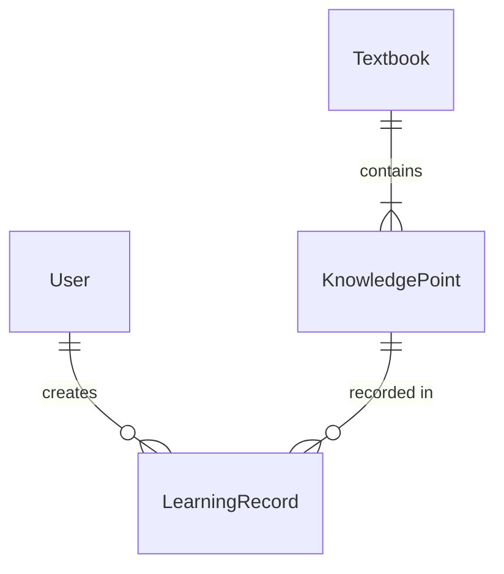

# Project Constitution - 数学通 (Math Learning System)

> 项目宪法 - 定义基本原则、约束条件、决策框架和开发工作流
> 
> **何时阅读**：首次接触项目时阅读，了解项目核心原则、技术决策和开发流程。

---

## Project Mission

**数学通**是一个面向高中学生的数学知识点学习系统，支持教材大纲展示、知识点学习、学习情况记录与分析。

**核心目标**:
1. 提供直观、灵活的知识点学习界面
2. 支持基于文件的知识库管理（Excel/CSV + Markdown）
3. 记录学习反馈并提供分析能力
4. 支持学生和教师两种角色

---

## Core Principles

### 1. 数据所有权

- 知识库存储在文件系统中（`iksm/` 目录）
- 学习反馈数据存储在 PostgreSQL 数据库
- 明确分离：知识内容是静态文件，用户数据是动态数据库

### 2. 分离关注点

**前端层**
- 技术: React 18+ + TypeScript 5+ + Vite
- 职责: 用户界面渲染、用户交互、状态管理
- 约束: 无直接数据库访问，通过 RESTful API 通信

**后端层**
- 技术: NestJS + Node.js + TypeScript
- 职责: 业务逻辑、数据验证、数据库访问、文件系统操作
- 约束: NestJS 模块化架构，依赖注入，支持水平扩展

**数据层**
- 技术: PostgreSQL 14+ (用户数据) + 文件系统 (知识库)
- 约束: 清晰的数据边界

### 3. 域模型（Domain Model）

**核心实体定义**

| 实体 | 英文名称 | 职责 | 存储位置 |
|------|---------|------|----------|
| **用户** | `User` | 系统使用者，支持学生/教师/管理员三种角色 | PostgreSQL |
| **知识点** | `KnowledgePoint` | 教材中的知识点，从文件解析生成 | PostgreSQL |
| **学习记录** | `LearningRecord` | 用户对知识点的学习反馈（时间、掌握程度） | PostgreSQL |
| **教材** | `Textbook` | 知识点的集合，对应一个 xlsx/csv + md 文件对 | 文件系统 + 元数据在 PostgreSQL |

**实体关系（ER）**



**关键字段约定**

| 实体 | 关键字段 | 说明 |
|------|---------|------|
| User | `id`, `email`, `passwordHash`, `name`, `role` (STUDENT/TEACHER/ADMIN), `studentInfo` (JSON), `createdAt` | 学生信息包含学号、班级 |
| KnowledgePoint | `id`, `code` (如 1.1.1), `level1`, `level2`, `level3`, `definition`, `characteristics`, `importanceLevel` (A/B/C), `textbookId`, `contentRef` (关联 md 文件位置) | 层级结构支持树形展示 |
| LearningRecord | `id`, `userId`, `knowledgePointId`, `startTime`, `durationMinutes`, `masteryLevel` (A/B/C/D/E), `notes`, `createdAt` | 不可更新，仅可创建 |
| Textbook | `id`, `name`, `fileName` (如 math01), `frameworkPath` (xlsx/csv), `contentPath` (md), `lastModifiedAt` | 文件变化检测依据 |

**命名约束**
- 数据库表名：小写蛇形复数（`users`, `knowledge_points`, `learning_records`）
- Prisma 模型名：PascalCase 单数（`User`, `KnowledgePoint`）
- 外键命名：`[table]_id`（如 `user_id`, `knowledge_point_id`）

### 4. NestJS 架构原则

**模块组织 (Modularity)**
- 按业务领域划分模块（Domain-Driven Design）
- 每个模块包含：Controller + Service + Module + DTO
- 模块之间通过清晰的导入/导出关系解耦

**依赖注入 (Dependency Injection)**
- 服务层通过构造函数注入依赖
- 使用 `@Injectable()` 装饰器标记可注入类
- 实现松耦合、易测试的组件关系

**分层架构**
```
Controller Layer    # 接收请求，调用服务
    ↓
Service Layer       # 业务逻辑，数据验证
    ↓
Repository/Prisma   # 数据访问抽象
    ↓
PostgreSQL          # 数据持久化
```

**核心组件**
| 组件 | 职责 | 装饰器 |
|------|------|--------|
| Controller | 路由处理、请求/响应 | `@Controller()` |
| Service | 业务逻辑 | `@Injectable()` |
| Module | 模块边界定义 | `@Module()` |
| Guard | 权限验证 | `@UseGuards()` |
| Pipe | 数据验证/转换 | `@UsePipes()` |
| DTO | 数据传输对象 | 类 + 验证装饰器 |

### 5. 可扩展性

- 知识库通过文件添加即可扩展新教材
- 支持多种知识点框架格式（.xlsx, .csv）
- 支持 LaTeX、Mermaid、ECharts 等扩展内容

---

## Technical Constraints

### Stack Requirements

| 层级 | 技术 | 版本要求 | 备注 |
|------|------|----------|------|
| 前端 | React + TypeScript + Vite | React 18+, TS 5+ | 严格模式 |
| 后端 | NestJS + Node.js | Node 18+ | TypeScript 严格模式，模块化架构 |
| ORM | Prisma | 5+ | 数据库访问和迁移 |
| 数据库 | PostgreSQL | 14+ | 用户数据存储 |
| 包管理 | pnpm | 8+ | 必须 |

### 特色功能技术

| 功能 | 技术方案 |
|------|----------|
| 数学公式展示 | LaTeX (KaTeX/MathJax) |
| 图表展示 | Mermaid.js |
| 数据分析图表 | ECharts |

### Project Structure

```
project-root/
├── web/                        # 前端 (React + Vite)
│   ├── src/
│   ├── package.json
│   └── vite.config.ts
│
├── server/                     # 后端 (NestJS + TypeScript)
│   ├── src/
│   ├── prisma/                 # Prisma schema and migrations
│   ├── package.json
│
├── iksm/                       # 知识库存储目录
│   ├── *.xlsx                  # 知识点框架文件
│   ├── *.csv                   # 知识点框架文件 (CSV格式)
│   └── *.md                    # 知识点详情文件
│
├── openspec/                   # OpenSpec 配置
│   ├── constitution.md         # 📍 本文档 (项目宪法)
│   ├── specs/                  # 能力规格定义目录
│   └── changes/                # 变更目录
│       └── archive/            # 已归档变更
│
└── doc/                        # 需求文档
    └── prompt/
        ├── project_target.md   # 项目目标
        └── iksm_hierichy.md    # 知识库数据规范
```

### Code Standards (Summary)

**详细规则见**：[.agents/skills/project-rule/SKILL.md](../.agents/skills/project-rule/SKILL.md)

**TypeScript**
- strict: true
- noImplicitAny: true
- 显式返回类型 on 公共函数

**React**
- 仅使用函数组件
- Props 必须定义接口

**命名规范**
- 组件: PascalCase
- 工具函数: camelCase
- 常量: UPPER_SNAKE_CASE
- 数据库表: snake_case, 复数

---

## Development Workflow (OpenSpec)

> **前置检查**：在使用 OpenSpec 前，请先阅读 [AGENTS.md](../AGENTS.md) 中的「OpenSpec 理解约束」章节，确保正确理解 OpenSpec 工具。

本项目采用 [OpenSpec](https://github.com/Fission-AI/OpenSpec) 进行结构化开发管理。

### 核心概念

| 概念 | 说明 | 对应文件 |
|------|------|----------|
| **Change** | 变更容器 | `openspec/changes/<name>/` |
| **Proposal** | 提案 | `proposal.md` |
| **Spec** | 规格 | `specs/<capability>/spec.md` |
| **Design** | 设计 | `design.md` |
| **Task** | 任务 | `tasks.md` |

### 完整工作流程

```
Explore → Propose → Apply → Archive
```

### 可用 Skills

| Skill | 用途 |
|-------|------|
| `openspec-explore` | 探索模式 - 思考问题、调查问题、澄清需求 |
| `openspec-propose` | 创建变更提案 - 生成 proposal、design、tasks |
| `openspec-apply-change` | 实施变更 - 执行 tasks.md 中的任务 |
| `openspec-archive-change` | 归档变更 - 完成后归档 |

### 变更大小分类

| 变更类型 | 说明 | 推荐方式 |
|----------|------|----------|
| **微小变更** | typo 修复、样式微调 | 直接编辑，无需 OpenSpec |
| **小型变更** | 单文件重构 | `openspec-propose` |
| **中型变更** | 新功能 | `openspec-propose` 完整流程 |
| **大型变更** | 架构调整 | `openspec-propose` + Design 文档 |

### 命名规范

#### 变更名称
- **格式**: kebab-case
- **模式**: `<action>-<object>-<description>`
- **示例**: `add-user-authentication`, `implement-knowledge-tree`

#### 能力名称
- **格式**: kebab-case
- **示例**: `auth`, `knowledge`, `learning`, `user`

### 工件格式

#### proposal.md
```markdown
## Why
## What Changes
## Capabilities
## Impact
```

#### design.md (Optional)
```markdown
## Context
## Goals / Non-Goals
## Decisions
## Risks / Trade-offs
```

#### tasks.md
```markdown
## 1. Module Name
- [ ] 1.1 Task description
- [ ] 1.2 Task description
```

### OpenSpec CLI 命令

```bash
openspec list --json
openspec new change <kebab-case-name>
openspec status --change <name>
openspec archive <name>
```

---

## Quality Gates

### Code Quality Checklist

**实施前**:
- [ ] 已阅读相关 OpenSpec 工件（如有）
- [ ] 确认技术方案（如有 Design）

**实施中**:
- [ ] 遵循项目代码规范
- [ ] TypeScript 严格模式通过

**实施后**:
- [ ] 无 `console.log` / `debugger`
- [ ] 无未使用变量/导入

### OpenSpec Checklist

**提交变更前检查**:
- [ ] 变更名称符合 kebab-case
- [ ] proposal.md 包含所有必需章节
- [ ] tasks.md 任务粒度合适（30分钟-2小时/任务）
- [ ] 生成的代码符合 project-rule 技术约束

---

## Decision Records

### 技术决策

| 日期 | 决策 | 理由 | 状态 |
|------|------|------|------|
| 2026-03-12 | React + TypeScript + Vite 前端栈 | 现代化、类型安全、快速开发 | 已确定 |
| 2026-03-12 | NestJS 后端框架 | 模块化架构、依赖注入、企业级设计模式 | 已确定 |
| 2026-03-12 | Prisma ORM | 类型安全、迁移方便 | 已确定 |
| 2026-03-12 | PostgreSQL 数据库 | 关系型数据、可靠性高 | 已确定 |
| 2026-03-12 | 文件存储知识库 | 便于管理、版本控制友好 | 已确定 |
| 2026-03-12 | pnpm 包管理 | 速度快、磁盘空间优化 | 已确定 |

---

## References

- [OpenSpec GitHub](https://github.com/Fission-AI/OpenSpec)
- [AGENTS.md](../AGENTS.md) - 项目总览
- [.agents/skills/project-rule/SKILL.md](../.agents/skills/project-rule/SKILL.md) - 代码规则
- [doc/prompt/project_target.md](../doc/prompt/project_target.md) - 项目目标

---

*Last Updated: 2026-03-12*
*Version: 1.0*
